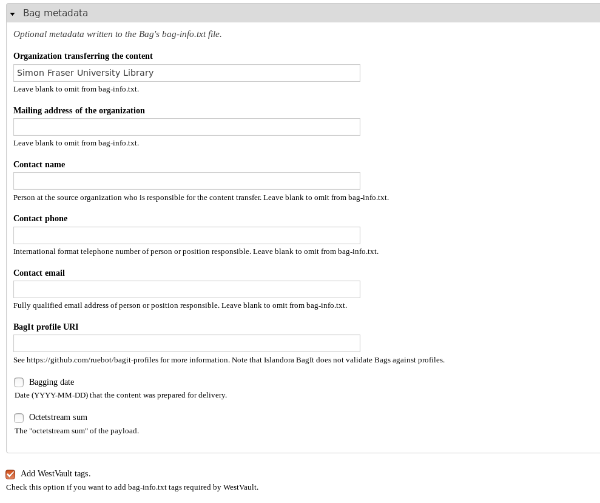

# Islandora WestVault

Islandora module that provides functionality specific to the [WestVault digital preservation network](https://coppul.ca/westvault).

## Introduction

Currently the only functionality this module provides is to add the following tags to Bags created for deposit into WestVault:

* `Bag-Size`: The size, in megabytes, of all files in the Bag's `data` directory.
* `Bagging-Date`
* `Internal-Sender-Description`: The value for this tag is taken from the object's Dublin Core `description` values.
* `Internal-Sender-Identifier`: The value for this tag is the object's PID.

`Source-Organization` is also required by WestVault, but is not added by this module; rather, it is added by the main Islandora BagIt module if the origanization's name is added to the "Organization transferring the content" field, as illustrated below.

## Requirements

* [Islandora](https://github.com/islandora/islandora)

[Islandora Bagit](https://github.com/islandora/islandora_bagit) is a soft dependency; if it is not installed, this module will do nothing.

## Installation

Install as usual, see [this](https://drupal.org/documentation/install/modules-themes/modules-7) for further information.

## Configuration

To use this module, go to Administration > Islandora > Islandora Utility Modules > Islandora BagIt. Make sure the "Add WestVault tags" option at the bottom of the form is checked. You should also make sure that you enter your institution's name in the "Organization transferring the content" field at the top of the "Bag metadata" group form elements:

## Maintainer

* [Mark Jordan](https://github.com/mjordan)

## Development and feedback

Bug reports, use cases, feature requests, and pull requests are welcome. Please open an issue before opening a pull request.

## License

* [GPLv3](http://www.gnu.org/licenses/gpl-3.0.txt)
